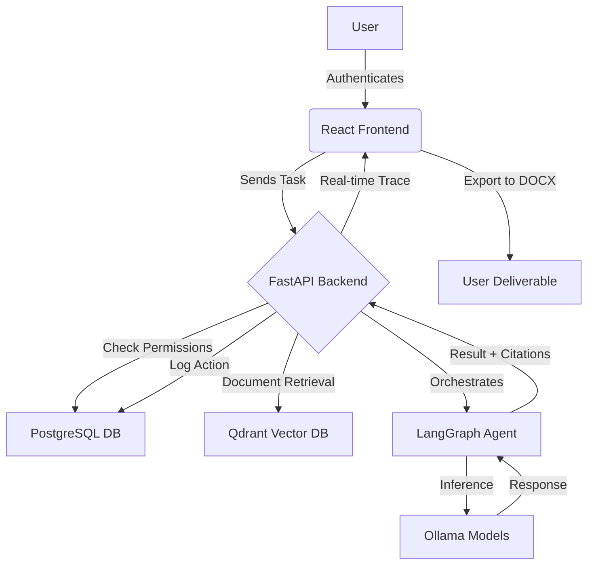
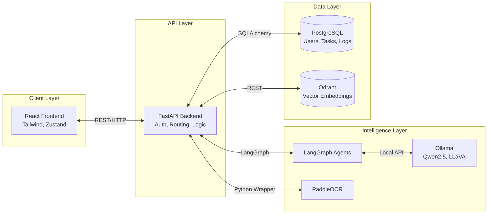
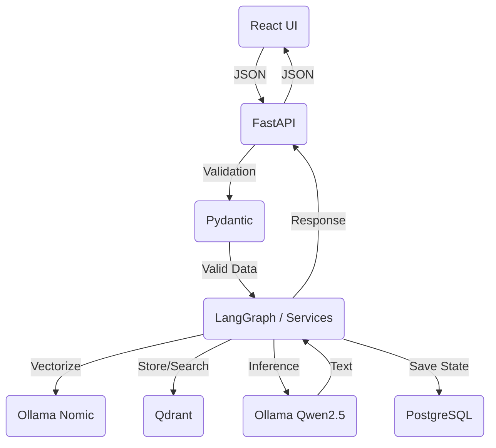
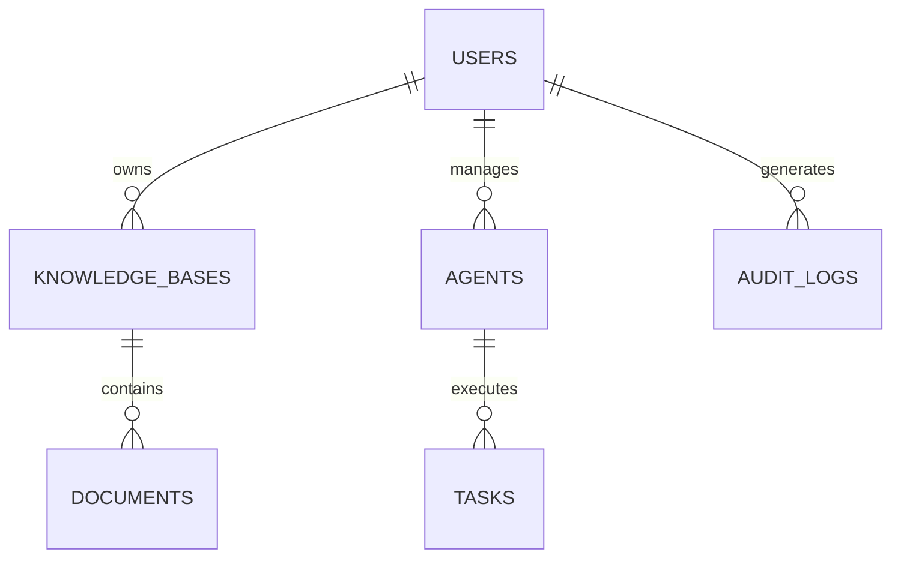

# 2. PROJECT OVERVIEW

**Project Name:** Sovereign AI Workbench
**One-Line Description:** A complete, production-ready, on-premise agentic AI workbench with zero external dependencies designed for data sovereignty and secure environments.
**Problem Being Solved:** Organizations with sensitive data (defense, healthcare, government) cannot use cloud-based AI solutions like ChatGPT or Claude due to data privacy risks, compliance issues, and lack of true data sovereignty.
**Target Users:** Enterprise administrators, security operators, data analysts, and secure facility personnel.
**Target Beneficiaries:** Government organizations, healthcare providers, defense contractors, and enterprises with strict data privacy requirements.
**Domain/Theme:** Smart India Hackathon 2026 - Problem Statement #117 (Data Sovereignty/Secure AI).
**Motivation:** To provide the power of modern LLMs and agentic workflows without compromising data security or relying on external internet connectivity.
**Current Situation:** Existing solutions either leak data to third-party cloud providers, lack role-based access controls, or are too complex to deploy locally in air-gapped environments.
**Proposed Solution:** A fully Dockerized, 100% on-premise AI workbench featuring LangGraph-powered agents, a localized Knowledge Base (RAG), multimodal capabilities, and an integrated Security Center ensuring zero external API calls.
**Main Objective:** To deliver a secure, localized AI ecosystem that guarantees data sovereignty.
**Secondary Objectives:** Provide a professional UI, strict Role-Based Access Control (RBAC), and comprehensive audit trails.
**Key Features:** 
- Agentic AI Workflows with real-time execution tracing
- RAG-based Knowledge Base with automatic chunking and document indexing
- Multimodal Analysis (Image understanding)
- Full RBAC (Admin, Operator, Analyst, Viewer)
- Security Center verifying 0 external API calls
- DOCX export for professional deliverables
**What Makes It Different:** It does not rely on *any* external APIs (like OpenAI). It runs completely locally using Ollama and Qdrant, providing a "cloud-like" AI experience entirely on-premise.

### Elevator Pitch
Sovereign AI Workbench is a 100% on-premise, secure AI platform designed for organizations handling highly sensitive data. It delivers powerful agentic workflows, document analysis, and multimodal capabilities locally, ensuring zero data leakage. With built-in role-based access control, comprehensive audit logging, and single-command Docker deployment, it brings enterprise-grade AI to air-gapped environments. 

### One-Line Pitch
An enterprise-grade, 100% on-premise AI workbench delivering powerful agentic workflows and true data sovereignty with zero external API calls.

### Problem → Solution Summary

| Problem | Our Solution | Expected Outcome |
| ------- | ------------ | ---------------- |
| Cloud AI risks data exposure | 100% on-premise local execution via Ollama | Zero data leakage, true data sovereignty |
| Difficult local AI deployment | Single-command Docker Compose orchestration | Scalable, reproducible 2-minute deployment |
| Lack of AI accountability | Comprehensive audit logs and RBAC | Full visibility and strict access control |
| Complex enterprise AI tasks | LangGraph-powered autonomous agents | Streamlined workflows and document analysis |

---

# 3. PROBLEM STATEMENT ALIGNMENT

**Problem Statement ID:** 117
**Core Problem:** The need for a secure, localized AI environment that prevents sensitive data from leaving the organization's infrastructure.
**Root Causes:** Cloud-based APIs inherently require data transmission over the internet, violating strict compliance regimes.
**Current Limitations:** Local LLM solutions are often bare-bones, lacking enterprise features like RAG, agents, RBAC, and a professional UI.
**Who is Affected:** Defense, government, healthcare, and financial institutions.
**Why the Problem Matters:** Data breaches and non-compliance can result in severe legal penalties, loss of IP, and national security risks.
**How Our Solution Addresses It:** By containerizing local open-weight models (Qwen, LLaVA, Nomic) alongside a vector database and an agent orchestrator, we create an intranet-bound AI system with zero external dependencies.

| Problem Requirement | Project Feature/Module | How It Addresses the Requirement |
| ------------------- | ---------------------- | -------------------------------- |
| Data Sovereignty | Local Ollama + Qdrant | All inference and embedding occur locally. No external APIs used. |
| Secure Access | JWT + RBAC System | 4-tier role system (Admin, Operator, Analyst, Viewer) restricts features. |
| Auditability | Audit Logs + Security Center | Every action is logged; sovereignty is actively monitored and reported. |
| Complex Task Execution | Agent Workspace | LangGraph agents break down tasks, retrieve knowledge, and format output. |

---

# 4. DETAILED SOLUTION

1. **How the system starts:** The system boots via `docker-compose up -d`, launching PostgreSQL, Qdrant, Ollama, the FastAPI backend, and the React frontend.
2. **What the user does:** The user logs into the React frontend (`http://localhost:3000`) and accesses the Agent Workspace or Knowledge Base based on their role.
3. **What happens internally:** If querying an agent, the FastAPI backend receives the request and initializes a LangGraph workflow.
4. **What data is collected:** User prompts, uploaded documents (PDF, DOCX, TXT), and images.
5. **How the data is processed:** Documents are chunked and vectorized using `nomic-embed-text`. Images are processed by `llava:7b`. Text prompts are processed by `qwen2.5:7b`.
6. **What algorithms/models are used:** Local LLMs (Qwen2.5, LLaVA), Vector Search (Qdrant), OCR (PaddleOCR).
7. **What output is generated:** Context-aware text responses, image analyses, and downloadable DOCX reports.
8. **How the output is presented to the user:** Through a responsive, dark/light mode React dashboard with real-time execution tracing.
9. **How the system handles errors/failures:** Real-time status indicators (⏳ running, ✅ completed, ❌ failed) and comprehensive error logging.
10. **What happens after the result is generated:** The user can export the result to DOCX, copy it, or view the complete execution trace. The action is recorded in the Audit Logs.



---

# 5. SYSTEM ARCHITECTURE

The architecture relies entirely on local Docker containers communicating over an internal Docker network. 



| Component | Technology | Purpose | Communication |
| --------- | ---------- | ------- | ------------- |
| Frontend | React 18, Vite | User Interface, routing, state | REST API to Backend |
| Backend | FastAPI, Python | API routing, Auth, Services | SQLAlchemy to DB, REST to Ollama/Qdrant |
| Relational DB | PostgreSQL 15 | Store users, roles, audit logs | Internal Docker network to Backend |
| Vector DB | Qdrant 2.7 | Store document embeddings for RAG | Internal Docker network to Backend |
| LLM Engine | Ollama | Run Qwen2.5, LLaVA, Nomic locally | Internal Docker network to Backend |
| Agent Engine | LangGraph | Multi-step agent workflow logic | In-memory Python library within Backend |

---

# 6. TECHNOLOGY STACK

### Frontend
* **Languages:** TypeScript 5+, HTML, CSS
* **Frameworks:** React 18
* **Libraries:** Zustand (State), React Router 6, Axios, Lucide React, docx, jspdf
* **UI Technologies:** Tailwind CSS 3+, Vite (Build)

### Backend
* **Languages:** Python 3.11+
* **Frameworks:** FastAPI 0.104+
* **APIs:** RESTful endpoints
* **Libraries:** SQLAlchemy 2.0, Alembic, LangGraph, PaddleOCR, JWT, Bcrypt, Docker SDK

### Database
* **Database technology:** PostgreSQL 15 (Relational), Qdrant 2.7 (Vector)
* **Schema:** Relational schema handled via Alembic migrations.
* **Important tables/collections:** users, knowledge_bases, documents, agents, tasks, audit_logs.
* **Relationships:** User -> KB (1:N), Agent -> Tasks (1:N), User -> Audit Logs (1:N).

### AI/ML
* **Models:** `qwen2.5:7b` (Text), `llava:7b` (Vision), `nomic-embed-text` (Embeddings)
* **Algorithms:** RAG (Retrieval-Augmented Generation), OCR
* **Libraries:** LangGraph, Ollama Python Client, PaddleOCR
* **Training/inference approach:** Local inference via Ollama (No training/fine-tuning currently implemented)
* **Input/output:** Text/Documents/Images -> Text/JSON/DOCX

### Cloud / APIs
* **Cloud services:** NONE (100% On-Premise)
* **Third-party APIs:** NONE (Air-gapped capable)
* **External integrations:** NONE (Sovereignty guaranteed)

### Development Tools
* **IDE:** VS Code / Antigravity IDE
* **Version control:** Git
* **Package managers:** npm (Frontend), pip (Backend)
* **Build tools:** Vite, Docker, Docker Compose

---

# 7. COMPLETE MODULE BREAKDOWN

### Module 1 — Authentication & RBAC
**Purpose:** Manages user identities, login sessions, and enforces role-based access.
**Input:** Username, Password (from Login UI).
**Processing:** Validates credentials via Bcrypt, generates short-lived JWT, checks role against endpoint requirements.
**Output:** JWT Token, User context.
**Technologies:** FastAPI Security, JWT, Bcrypt, PostgreSQL.
**Important Files:** `backend/app/api/auth.py`, `backend/app/models/user.py`.

### Module 2 — Knowledge Base & Document Processing (RAG)
**Purpose:** Ingests documents, extracts text, generates embeddings, and allows semantic search.
**Input:** PDF, DOCX, TXT files.
**Processing:** Text extraction (OCR via PaddleOCR if needed), chunking (1000 chars, 200 overlap), embedding via `nomic-embed-text`, storage in Qdrant.
**Output:** Indexed documents ready for vector search.
**Technologies:** PaddleOCR, Qdrant, Ollama embeddings.
**Important Files:** `backend/app/services/rag_service.py`, `backend/app/api/documents.py`.

### Module 3 — Agent Workspace (LangGraph Orchestration)
**Purpose:** Executes multi-step AI reasoning to answer complex queries using local tools.
**Input:** User text query, Selected Knowledge Base, Selected Agent Profile.
**Processing:** LangGraph state machine moves through: Understanding -> Retrieval (RAG) -> Tool Execution -> Generation.
**Output:** Final context-aware text response with citations.
**Technologies:** LangGraph, FastAPI, Ollama.
**Important Files:** `backend/app/services/agent_orchestrator.py`, `backend/app/api/agents.py`.

### Module 4 — Security Center & Audit Logging
**Purpose:** Proves data sovereignty and tracks user activity.
**Input:** System events, API calls.
**Processing:** Logs every state change to the DB. Monitors external network calls to ensure zero leakage.
**Output:** Security metrics, PDF compliance reports.
**Technologies:** SQLAlchemy, jspdf.
**Important Files:** `backend/app/api/security.py`, `backend/app/models/audit_log.py`.

### Module 5 — Multimodal Analysis
**Purpose:** Analyzes images securely on-premise.
**Input:** Image files (PNG, JPG).
**Processing:** Passes image through local `llava:7b` vision model via Ollama.
**Output:** Textual description, code analysis, or OCR extraction from the image.
**Technologies:** Ollama (LLaVA), FastAPI.
**Important Files:** `backend/app/api/multimodal.py`.

---

# 8. FILE AND CODEBASE STRUCTURE

```text
sih-sovereign-ai/
├── backend/
│   ├── app/
│   │   ├── api/         (REST API controllers)
│   │   ├── models/      (SQLAlchemy DB models)
│   │   ├── schemas/     (Pydantic validation schemas)
│   │   ├── services/    (Core business logic: RAG, Agents, Auth)
│   │   └── tools/       (Agent tools)
│   ├── alembic/         (DB Migration scripts)
│   ├── requirements.txt (Python dependencies)
│   └── Dockerfile       (Backend container config)
├── frontend/
│   ├── src/
│   │   ├── components/  (Reusable React UI: Buttons, Modals)
│   │   ├── pages/       (11 distinct page views)
│   │   ├── services/    (Axios API wrappers)
│   │   ├── store/       (Zustand state management)
│   │   └── theme/       (Dark/Light mode logic)
│   ├── package.json     (Node dependencies)
│   └── Dockerfile       (Frontend container config)
└── docker-compose.yml   (Orchestrates 5 main services)
```

| File/Folder | Purpose | Importance |
| ----------- | ------- | ---------- |
| `docker-compose.yml` | Main deployment configuration | CRITICAL |
| `backend/app/services/agent_orchestrator.py` | LangGraph agent logic | HIGH |
| `backend/app/services/rag_service.py` | Document embedding and retrieval | HIGH |
| `frontend/src/store/` | Global React state management | HIGH |
| `CURRENT_STATUS.md` | Tracks live project state and bugs | MEDIUM |

---

# 9. DATA FLOW

1. **Input Source:** User inputs text/files via React Frontend.
2. **Data Acquisition:** Axios sends HTTP POST to FastAPI backend.
3. **Validation:** Pydantic schemas validate request payloads.
4. **Preprocessing:** Documents are text-extracted and chunked.
5. **Processing (AI):** Chunks sent to Ollama (`nomic-embed-text`) -> Qdrant. Prompts sent to LangGraph -> Ollama (`qwen2.5:7b`).
6. **Database Operations:** Audit logs and task statuses saved to PostgreSQL via SQLAlchemy.
7. **Output Generation:** LLM streams or returns final markdown text.
8. **Visualization/UI:** React components render the response, showing a real-time trace animation.



---

# 10. AI/ML DETAILS

**AI/ML Problem:** Providing intelligent enterprise-grade search, summarization, agentic automation, and vision capabilities securely on-premise without cloud APIs.
**Models Used:**
- `qwen2.5:7b` (General text generation and agent reasoning)
- `llava:7b` (Multimodal/Vision capabilities)
- `nomic-embed-text` (Text embedding for RAG)
**Why these models:** They offer state-of-the-art performance for their size, capable of running efficiently on local hardware (GPUs or even CPUs) while maintaining high reasoning quality.
**Input:** Text prompts, Documents (PDF/DOCX), Images.
**Output:** Text answers, Summaries, Extracted image data.
**Dataset:** Pre-trained weights (No local fine-tuning is currently implemented).
**Data Preprocessing:** Document chunking (1000 characters, 200 character overlap) and PaddleOCR for image-based PDFs.
**Training Process:** Not specified in the project (Pre-trained models used).
**Inference Process:** Executed locally via the Ollama server in a dedicated Docker container.
**Evaluation Metrics:** Not specified in the project.
**Model Limitations:** Context window limits based on VRAM; 7B models may hallucinate on highly complex multi-step reasoning compared to massive cloud models.
**Computational Requirements:** ~16GB+ RAM minimum. Dedicated GPU highly recommended for low latency.

---

# 11. DATABASE DETAILS

**Database Technology:** PostgreSQL 15 (Relational) & Qdrant 2.7 (Vector)
**Tables/Collections:**
1. `users` (id, username, password_hash, role, is_active)
2. `knowledge_bases` (id, name, description, user_id)
3. `documents` (id, filename, status, knowledge_base_id)
4. `agents` (id, name, system_prompt, user_id)
5. `tasks` (id, query, result, agent_id, status)
6. `audit_logs` (id, user_id, action, resource, timestamp)

**Relationships:**
- Users have multiple KBs, Agents, Tasks, and Audit Logs.
- KBs have multiple Documents.
- Agents have multiple Tasks.



---

# 12. API DOCUMENTATION

| Method | Endpoint | Purpose | Input | Output |
| ------ | -------- | ------- | ----- | ------ |
| POST | `/api/auth/login` | Authenticate user | Username/Password | JWT Token |
| GET | `/api/agents` | List available agents | JWT (Auth Header) | List of Agent JSON objects |
| POST | `/api/agents/{id}/query` | Execute a task | Task details JSON | Task execution status |
| POST | `/api/documents/upload` | Upload doc for RAG | File, KB ID | Document metadata |
| GET | `/api/audit-logs` | Retrieve security logs | JWT (Admin/Viewer) | List of Logs |
| POST | `/api/multimodal/analyze` | Image analysis | Image file | Analysis text |

**Authentication:** Bearer JWT tokens.
**Response Format:** Standard JSON envelopes.
**Error Handling:** HTTP 400/401/403/500 with standard FastAPI error messages.

---

# 13. USER EXPERIENCE / USER JOURNEY

1. **Entry Point:** User opens `http://localhost:3000`.
2. **Login:** User selects a demo account (Admin/Operator/Analyst/Viewer) and enters password (`demo123`).
3. **Main Dashboard:** User lands on a clean dashboard showing System Health (DB, Ollama, Qdrant statuses) and recent activity. User can toggle Dark/Light mode in the top right.
4. **Input Process (Knowledge Base):** User navigates to Knowledge Base, creates a collection, and uploads a PDF. System shows real-time indexing status.
5. **Input Process (Agent Workspace):** User selects an Agent, selects the newly created Knowledge Base, and types a query.
6. **Processing:** Upon execution, the UI shows a real-time trace animation (Understanding -> Retrieving -> Executing -> Generating).
7. **Results:** The final AI response is displayed alongside document citations.
8. **Actions Available:** User clicks "Export to DOCX" to download a professional report.
9. **Exit/Logout:** User clicks profile icon and logs out.

---

# 14. INNOVATION AND UNIQUENESS

**What is innovative?** Packaging a complex, multi-service AI pipeline (LangGraph + Vector DB + LLM Server + OCR + Auth) into a single, one-click deployable Dockerized environment that strictly enforces air-gapped security.
**What existing approaches lack:** Cloud AI (ChatGPT) leaks data. Local UI wrappers (LMStudio) lack enterprise RBAC, audit logging, and agentic LangGraph workflows.
**Our Advantage:** We bridge the gap between enterprise security and modern AI capabilities.

| Existing Approach | Limitation | Our Approach | Advantage |
| ----------------- | ---------- | ------------ | --------- |
| ChatGPT Enterprise | Data leaves the intranet | 100% On-Premise via Ollama | True Data Sovereignty, Zero Leakage |
| Basic Local LLMs | Just a chat interface, no docs | Integrated RAG & LangGraph Agents | Automates complex tasks with internal data |
| Cloud Vector APIs | Expensive, privacy risks | Local Qdrant container | Fast, free, secure embeddings |

---

# 15. FEASIBILITY

### Technical Feasibility
Highly feasible. Built entirely on proven, open-source technologies (Docker, React, FastAPI, PostgreSQL, Ollama). Implementation complexity is managed through Docker Compose orchestration.
### Operational Feasibility
Excellent. Deployment takes under 2 minutes (`docker-compose up -d`), requiring zero complex dependency management on the host machine. 
### Economic Feasibility
Exceptional. Uses open-weight models (Qwen, LLaVA) and open-source infrastructure. Incurs zero API costs. The only cost is on-premise hardware (compute/GPU).
### Deployment Feasibility
Can be deployed on any local server, workstation, or secure intranet running Docker. No internet required after initial image/model pull.

---

# 16. SCALABILITY

**Current Scalability:** The system is containerized, allowing individual services (Backend, Database, Qdrant) to be scaled across nodes if migrated to Kubernetes.
**Cloud Deployment:** While designed for on-premise, the Dockerized architecture can trivially be deployed to private VPCs (AWS GovCloud, Azure).
**More Users:** PostgreSQL and FastAPI handle concurrent requests efficiently.
**Bottleneck:** The Ollama container (GPU inference) is the primary bottleneck. Scaling requires deploying multiple Ollama instances behind a load balancer.

---

# 17. SECURITY AND PRIVACY

* **Authentication:** JWT tokens (24h expiry) + Bcrypt hashing.
* **Authorization:** 4-tier Role-Based Access Control (Admin, Operator, Analyst, Viewer). Models and settings are locked to Admins/Operators.
* **Network Security:** The system operates natively over an isolated Docker network. No external API calls are made (verified via Security Center).
* **Audit Logging:** Every user action (login, query, document upload) is permanently recorded in the DB and visible in the Audit Logs page.
* **Missing/Future:** Currently lacks database-at-rest encryption (depends on host filesystem security) and HTTPS/TLS for the local frontend (typically handled by a reverse proxy in production).

---

# 18. POTENTIAL CHALLENGES AND RISKS

| Challenge/Risk | Impact | Probability | Mitigation Strategy |
| -------------- | ------ | ----------- | ------------------- |
| Hardware limitations (No GPU) | High | Medium | Use smaller quantized models (e.g. Qwen2.5 7B instead of 72B). System defaults to CPU execution if GPU absent. |
| LLM Hallucination | High | Medium | Enforce strict LangGraph agent prompts and mandate RAG citation to ground answers in actual documents. |
| Model Download Size | Low | High | Pre-package models into custom Docker images for fully air-gapped installations. |

---

# 19. IMPACT AND BENEFITS

| Stakeholder | Problem | Benefit |
| ----------- | ------- | ------- |
| Defense/Gov Agencies | Cannot use cloud AI due to classification | Access to modern Agentic AI workflows entirely on secure intranets. |
| Security Teams | Lack of visibility into AI usage | Comprehensive audit logs and 0 external call guarantees. |
| Data Analysts | Manual document processing takes days | RAG-powered agents summarize and answer queries in seconds. |

**Technical Impact:** Proves that enterprise-grade agent workflows can be run efficiently on consumer/prosumer local hardware.
**Economic Impact:** Eliminates recurring SaaS AI API costs.

---

# 20. REAL-WORLD USE CASES

1. **Defense Contract Analysis:** 
   - *Problem:* A defense contractor needs to analyze hundreds of classified RFPs.
   - *Usage:* They upload PDFs to the Knowledge Base and use the Agent to summarize requirements. No data leaves the secure facility.
2. **Healthcare Records Processing:**
   - *Problem:* Hospitals cannot upload patient records to ChatGPT due to HIPAA.
   - *Usage:* Using Sovereign AI Workbench locally, doctors can query patient histories securely.
3. **Financial Compliance Audit:**
   - *Problem:* Analyzing internal financial ledgers securely.
   - *Usage:* Multimodal/OCR tools extract data from scanned receipts locally.

---

# 21. FUTURE SCOPE

**FUTURE / NOT CURRENTLY IMPLEMENTED**
* **Hardware Integration:** Integration with secure hardware enclaves (e.g., TPM, SGX) for encrypted model execution.
* **Advanced Multi-Agent Swarms:** Expanding LangGraph to allow multiple agents to debate and collaborate.
* **Active Directory Integration:** Support for enterprise LDAP/SAML SSO.
* **Local Web Search Tool:** Implementing an internal corporate wiki search tool for agents.
* **Database Encryption:** Native at-rest encryption within the PostgreSQL container.

---

# 22. IMPLEMENTATION STATUS

| Feature | Status | Evidence/File |
| ------- | ------ | ------------- |
| Docker Compose Setup | Implemented | `docker-compose.yml` |
| React UI (Dark/Light) | Implemented | `frontend/src/theme/`, `PROJECT_SUMMARY.md` |
| RBAC Auth System | Implemented | `backend/app/api/auth.py` |
| RAG with Qdrant | Implemented | `backend/app/services/rag_service.py` |
| LangGraph Agents | Implemented | `backend/app/services/agent_orchestrator.py` |
| Security Audit Center | Implemented | `backend/app/api/security.py` |
| Multimodal Analysis | Implemented | `backend/app/api/multimodal.py` |
| Automated Testing (Unit/Integration) | Planned | Not specified in the project. |

---

# 23. TESTING

**"Not specified in the project."**
Currently, the codebase relies on manual functional verification. 
*Recommendation for future:* Add `pytest` for backend unit tests covering JWT validation and Agent state machines, and `Jest`/`Cypress` for frontend UI testing.

---

# 24. PERFORMANCE

* **Cold start:** ~11 seconds (for all Docker services to initialize).
* **API Response (Standard):** < 100ms (without LLM inference).
* **Page Load:** < 1 second.
* **Theme Toggle:** Instant.
* **Model Inference:** Depends entirely on host hardware (CPU vs GPU).
* *Note: Exact inference tokens-per-second benchmarks are not currently available in the project.*

---

# 25. DEPLOYMENT

**Prerequisites:** Docker, Docker Compose, 16GB+ RAM.
**Installation:**
```bash
git clone <repository>
cd sih-sovereign-ai
docker-compose up -d
```
**Model Setup (First Time):**
```bash
docker exec -it sih-ollama ollama pull qwen2.5:7b
docker exec -it sih-ollama ollama pull nomic-embed-text
docker exec -it sih-ollama ollama pull llava:7b
```
**Ports:** Frontend (`3000`), Backend API (`8000`), Qdrant (`6333`), Ollama (`11434`).

---

# 26. DEMO FLOW

Based on the implemented features in `CURRENT_STATUS.md`:
1. **Login (30s):** Show demo account selector. Login as `admin` to show full access. Toggle Dark Mode to demonstrate professional UI.
2. **Dashboard (30s):** Highlight the System Health widgets indicating DB, Vector DB, and Ollama are live.
3. **Security Center (1m):** Show the Sovereignty Status proving 0 external API calls and view the Audit Log tracking the login event.
4. **Knowledge Base (1m):** Create a collection, upload a sample document, and show the automatic indexing status.
5. **Agent Workspace (2m):** Select an agent, enter a query against the uploaded document. **Crucial:** Highlight the real-time execution trace animation (Understanding -> Retrieving -> Executing).
6. **Export:** Export the final result to DOCX.

---

# 27. SIH PRESENTATION CONTENT

## SLIDE 1 — TITLE PAGE
* **SMART INDIA HACKATHON 2026**
* **Problem Statement ID:** 117
* **Problem Statement Title:** [TO BE PROVIDED] (Data Sovereignty/Secure AI)
* **Theme:** [TO BE PROVIDED]
* **PS Category:** Software
* **Team ID:** [TO BE PROVIDED]
* **Team Name:** [TO BE PROVIDED]
* **Project/Idea Title:** Sovereign AI Workbench

## SLIDE 2 — IDEA TITLE / PROPOSED SOLUTION
* **Title:** Sovereign AI Workbench: 100% On-Premise Enterprise AI
* **Proposed Solution:** A Dockerized, locally-hosted AI platform featuring agentic workflows, RAG, and multimodal capabilities that requires zero internet access.
* **Addressing the Problem:** Guarantees absolute data sovereignty by processing all sensitive prompts, documents, and images entirely on the organization's intranet.
* **Innovation:** Combines complex LangGraph agent reasoning with strict enterprise RBAC and audit logging in a single-click deployable package.

## SLIDE 3 — TECHNICAL APPROACH
* **Architecture:** React/Vite (Frontend) -> FastAPI (Backend) -> PostgreSQL (Data) + Qdrant (Vectors) + Ollama (LLM Inference).
* **AI/ML Core:** Qwen2.5 (Text), LLaVA (Vision), Nomic (Embeddings), managed by LangGraph.
* **Workflow:** User Query -> FastAPI -> Agent orchestrates knowledge retrieval from Qdrant -> Ollama generates response -> Trace sent via REST to React UI.
*(Include the Flowchart from Section 5 here)*

## SLIDE 4 — FEASIBILITY AND VIABILITY
* **Technical:** Highly viable. Uses mature, open-source containerization (Docker) and proven local LLM runners (Ollama).
* **Operational:** Deploys in minutes via `docker-compose up -d`. Manageable by standard IT admins.
* **Economic:** Zero recurring API costs. Completely open-source software stack.
* **Challenges & Mitigation:** Hardware requirements for LLMs are high -> Mitigated by utilizing efficient 7B parameter models (Qwen2.5) that can run on standard enterprise hardware.

## SLIDE 5 — IMPACT AND BENEFITS
* **Target Audience:** Defense, Government, Healthcare, Enterprise Security.
* **Security Benefit:** 100% Data Sovereignty. Prevents accidental corporate data leaks to public AI models.
* **User Benefit:** Empowers analysts in air-gapped environments with state-of-the-art AI automation.
* **Scalability:** Stateless backend and containerized architecture allows easy scaling across internal data centers.

## SLIDE 6 — RESEARCH AND REFERENCES
* **Technologies:** LangGraph, FastAPI, React, Docker, PostgreSQL.
* **AI Models:** Qwen2.5-7B (Alibaba), LLaVA (Visual Instruction Tuning), Nomic AI Embeddings.
* **Documentation:** Built on OpenAPI specs and standard React design patterns.

---

# 28. JUDGE Q&A PREPARATION

### Problem
**Q: Why is this problem important?**
*A:* Organizations handling classified or HIPAA data simply cannot use ChatGPT. Sending that data to the cloud is illegal or violates security protocols. They need AI power locally.

### Solution
**Q: How does your solution actually ensure data doesn't leak?**
*A:* Our entire stack—Frontend, Backend, Database, Vector Store, and the AI models—runs inside local Docker containers. We have a built-in Security Center module that actively monitors for external network calls, proving zero dependencies.

### Technology
**Q: Why Ollama and Qwen2.5?**
*A:* Ollama provides the most robust, cross-platform containerized execution for local LLMs. Qwen2.5 7B was chosen because it punches above its weight in reasoning tasks while fitting comfortably in standard 16GB VRAM hardware, making local deployment actually feasible.
**Q: Why use LangGraph instead of standard LangChain?**
*A:* LangGraph allows us to build cyclical, state-machine-based agents that can reason, loop, and correct themselves, which is critical for complex enterprise tasks, rather than simple linear chains.

### Innovation
**Q: What is unique about this? Can't I just use LM Studio?**
*A:* Basic tools like LM Studio just provide a chat interface. We built a full enterprise workbench featuring LangGraph agents, automated Document RAG, 4-tier Role-Based Access Control, and comprehensive audit logging, all orchestrated in a single docker-compose stack.

### Feasibility & Scalability
**Q: Can this scale to 1000 users?**
*A:* The web tier (FastAPI/React) and database (PostgreSQL) can scale trivially. The bottleneck is GPU inference. To scale to 1000 users, an organization would deploy multiple Ollama instances behind a load balancer on their internal GPU cluster.

### Security
**Q: How is the system secured internally?**
*A:* All endpoints require Bearer JWT authentication. We implement strict RBAC—for example, Viewers cannot execute agents, and only Admins can access the Security Center. Every single action is permanently logged to the database.

---

# 29. PITCHES

### 30-Second Pitch
"Sovereign AI Workbench gives defense and healthcare organizations the power of modern AI without leaking data to the cloud. It is a 100% on-premise, containerized AI platform featuring autonomous agents, document analysis, and strict access controls—all running locally with zero external API calls."

### 1-Minute Pitch
"Enterprises face a dilemma: they need the productivity boost of AI, but they cannot send sensitive data to cloud providers like OpenAI. Sovereign AI Workbench solves this. We’ve built a completely on-premise, Dockerized AI ecosystem. It combines Qwen2.5 models running locally via Ollama, LangGraph-powered agents, and a secure Qdrant vector database for document search. With built-in role-based access control, real-time audit logging, and zero external dependencies, we bring enterprise-grade AI securely into air-gapped environments."

### 3-Minute Pitch
*(Structure for Presentation)*
"Good morning. Our project addresses a critical vulnerability in modern enterprise workflow: Data Sovereignty in the age of AI. Today, using cloud-based AI means sending sensitive, proprietary, or classified data outside the organization's firewall. For defense, government, and healthcare, this is a non-starter. 

Our solution is the Sovereign AI Workbench. It is a fully containerized, 100% on-premise AI platform. 
Technically, we orchestrate 5 distinct services: a React frontend, a FastAPI backend, PostgreSQL for audit logs, Qdrant for vector storage, and Ollama running advanced 7B parameter models like Qwen2.5 and LLaVA. 

What makes our project unique isn't just running a local model—it's the enterprise wrapper. We implemented LangGraph to create autonomous agents that can process multi-step workflows. We built a seamless RAG pipeline allowing users to upload PDFs and instantly query them locally. Furthermore, we built a 4-tier Role-Based Access Control system and an Admin Security Center that actively proves zero external network calls are being made.

It deploys in under two minutes via Docker Compose. It costs nothing in recurring API fees, and it guarantees absolute data security. Sovereign AI Workbench is the bridge between cutting-edge AI and uncompromising enterprise security."

---

# 30. FINAL EXECUTIVE SUMMARY

### Project in 5 bullets
* 100% on-premise AI workbench with zero external API calls.
* Containerized via Docker for instant deployment.
* LangGraph agents and Qdrant vector database for local RAG.
* 4-tier Role-Based Access Control and full audit logging.
* Uses local Ollama models (Qwen2.5, LLaVA, Nomic).

### Project in 10 bullets
* Designed for air-gapped defense, gov, and healthcare environments.
* Complete React UI with Dark/Light mode and responsive design.
* FastAPI backend backed by PostgreSQL 15.
* Automated document chunking and local embedding.
* Multimodal support for local image analysis.
* Real-time execution tracing for agent workflows.
* Professional DOCX export for end-user deliverables.
* Built-in Security Center verifies data sovereignty.
* Zero recurring SaaS API costs.
* Fully functional and completed according to project specs.

### Key Innovation
Bringing complex, multi-agent AI workflows and enterprise security features (RBAC, Audit) into a single, fully local, air-gapped containerized ecosystem.

### Key Technology
LangGraph (Agent orchestration) + Ollama (Local inference) + Docker (Deployment).

### Key Impact
Enables strict-compliance industries to leverage modern AI productivity without violating data privacy laws or relying on internet connectivity.

### Key Differentiator
Unlike standard local chat wrappers, this is a complete enterprise application with distinct user roles, document management, and verifiable sovereignty.

### Current Implementation Status
100% Implemented (All services, UI, Backend, DB, Docker, and Models are fully functional).

### Biggest Strength
Turn-key deployment (Docker Compose) combined with absolute data privacy.

### Biggest Risk
Hardware requirements (GPUs) are needed for optimal inference speed.

### Most Important Future Improvement
**FUTURE / NOT CURRENTLY IMPLEMENTED:** Integration with Active Directory/SSO for enterprise identity management.
